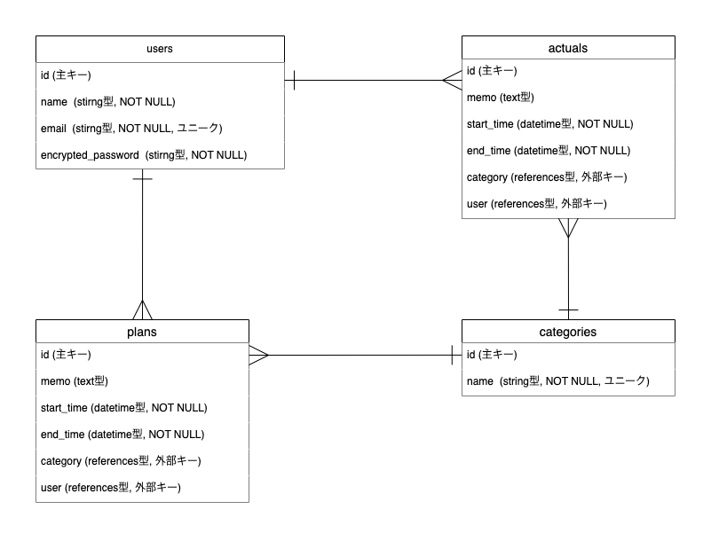

# SchedPoint (スケッドポイント)

## 1. アプリ概要

**SchedPoint** は、日々の「予定」と「実績」を時間軸上で可視化し、比較・分析することで、ユーザーの時間管理能力の向上をサポートする Web アプリケーションです。将来的には、予定と実績の差を「ポイント」として定量化し、日々の成長を可視化することを目指しており、これが「SchedPoint」という名称の由来です。

このアプリケーションは、Web 系エンジニアへの転職を目指すポートフォリオとして制作されました。

### **アプリケーション URL**

- **フロントエンド:** [https://schedpoint-frontend.onrender.com/](https://schedpoint-frontend.onrender.com/)
- **バックエンド API:** [https://schedpoint-api.onrender.com/](https://schedpoint-api.onrender.com/)

### **テスト用アカウント**

- **Email:** `test@example.com`
- **Password:** `password`

## 2. 利用方法

1.  新規登録ページからアカウントを作成するか、上記のテスト用アカウントでログインします。
2.  ログイン後、カレンダー画面右上の「+作成」ボタンから「予定」または「実績」を登録します。
3.  登録した予定や実績をクリックするとモーダルが開き、内容の更新・削除ができます。
4.  ヘッダーの日付ナビゲーション（「前日」「翌日」「今日」）で、表示する日付を切り替えられます。

### 注意事項

**ログインに時間がかかる場合があります:**
無料のデプロイサービス（Render）を利用しているため、サーバーがスリープ状態になっている場合があります。その場合、初回のアクセスやログイン時にサーバーの起動処理が発生し、応答までに 10〜30 秒程度かかることがあります。恐れ入りますが、しばらくお待ちください。

## 3. 解決したい課題

「もっと時間を有効に使えたはずだ」と後悔しがちなビジネスパーソンが、自身の時間の使い方を客観的に把握し、生産性の低い行動パターンに気づくきっかけを提供することを目指しました。

「計画（予定）」と「現実（実績）」を並べて比較することで、自身の時間感覚のズレを認識し、より現実的で精度の高いスケジュール管理ができるようになることをサポートします。

## 4. 主な機能

- **ユーザー認証**: JWT(JSON Web Token)を利用した、安全なトークンベース認証を実装。ログイン状態は永続化されます。
- **カレンダー表示**: 1 日単位で「予定」と「実績」を並べて表示。日付移動もスムーズに行えます。日付をまたぐ予定も正しく分割表示されます。
- **予定・実績の CRUD 管理**: カレンダーから直感的に予定や実績を作成。クリックすればモーダルが開き、更新・削除も簡単に行えます。
- **動的なデータ連携**: 予定・実績の作成・更新・削除は、画面をリロードすることなくカレンダーに即時反映されます。
- **堅牢なバックエンド**: Rails のバリデーション機能を活用し、不正なデータ（時間の逆転、長すぎるメモなど）が登録されるのを防ぎます。エラーメッセージも日本語で表示されます。

## 5. 画面イメージ

- **ユーザー新規登録画面、ログイン画面**

[](https://gyazo.com/6357e3843e021aaa5e46292cea5be35d)

[](https://gyazo.com/1fa9bd8dfb103e8faa2f8f4baa48b502)

- **カレンダー画面:** 1 日表示形式で、時間軸に沿って「予定」と「実績」を並べて表示。「＋作成」ボタン（ドロップダウン形式）や日付移動ボタンを配置

[](https://gyazo.com/2d2b9593f898c28f15016d63a84794ad)

- **予定・実績作成画面:** カテゴリ選択、日時指定、メモ入力欄を配置した共通フォーム画面

[](https://gyazo.com/dbc7befa6151aba103f3db91e9043399)

- **予定・実績 詳細/編集モーダル:** 既存の予定や実績をクリックすると表示され、内容の更新・削除が可能なモーダルウィンドウ

[](https://gyazo.com/d82f4495e6bea8bfc7394e1d31b0a6e0)

## 6. 使用技術

### バックエンド

- **言語**: Ruby 3.2.0
- **フレームワーク**: Ruby on Rails 7.1 (API モード)
- **データベース**: MySQL (開発環境), PostgreSQL (本番環境)
- **認証**: Devise, Devise-JWT
- **API**: `jsonapi-serializer` を用いた RESTful API (ver. `/api/v1/`)
- **Web サーバー**: Puma

### フロントエンド

- **言語**: JavaScript
- **フレームワーク**: Vue.js 3 (Composition API)
- **状態管理**: Pinia
- **HTTP クライアント**: Axios
- **ルーティング**: Vue Router
- **UI/スタイリング**: Tailwind CSS, Font Awesome

### インフラ・開発環境

- **デプロイ**: Render (Web Service / Static Site)
- **コード品質**: RuboCop, Prettier (保存時自動整形)
- **テスト**: Postman (API エンドポイントテスト), 手動総合テスト
- **実行環境**: foreman

## 7. データベース設計

### ER 図



### users テーブル

| Column             | Type    | Options                   |
| ------------------ | ------- | ------------------------- |
| id                 | integer | primary_key, null: false  |
| name               | string  | null: false               |
| email              | string  | null: false, unique: true |
| encrypted_password | string  | null: false               |

#### Association

- has_many :plans
- has_many :actuals

### plans テーブル

| Column      | Type       | Options                                       |
| ----------- | ---------- | --------------------------------------------- |
| id          | integer    | primary_key, null: false                      |
| memo        | text       |                                               |
| start_time  | datetime   | null: false                                   |
| end_time    | datetime   | null: false                                   |
| user_id     | references | null: false, foreign_key: true(users.id)      |
| category_id | references | null: false, foreign_key: true(categories.id) |

#### Association

- belongs_to :user
- belongs_to :category

### actuals テーブル

| Column      | Type       | Options                                       |
| ----------- | ---------- | --------------------------------------------- |
| id          | integer    | primary_key, null: false                      |
| memo        | text       |                                               |
| start_time  | datetime   | null: false                                   |
| end_time    | datetime   | null: false                                   |
| user_id     | references | null: false, foreign_key: true(users.id)      |
| category_id | references | null: false, foreign_key: true(categories.id) |

#### Association

- belongs_to :user
- belongs_to :category

### categories テーブル

| Column | Type    | Options                   |
| ------ | ------- | ------------------------- |
| id     | integer | primary_key, null: false  |
| name   | string  | null: false, unique: true |

#### Association

- has_many :plans
- has_many :actuals

## 8. 今後の展望 (MVP 以降)

- レスポンシブ対応
- 予定遂行度合いを点数化する機能
- 点数をグラフ表示し点数の推移を可視化する機能
- 週間/月間カレンダー表示機能
- ユーザーによるカテゴリ管理機能
- 予定と実績の時間帯重複チェック機能
- Google カレンダーと API 連携し「予定」を自動入力する機能
- 生成 AI の API を活用し AI による行動改善提案機能

## 9. 開発環境構築手順 (ローカル)

1.  **リポジトリをクローン:**

    ```bash
    git clone https://github.com/barsea/schedpoint.git
    cd schedpoint
    ```

2.  **バックエンドのセットアップ:**

    ```bash
    # Gemのインストール
    bundle install

    # データベースの作成とマイグレーション、初期データの投入
    rails db:create
    rails db:migrate
    rails db:seed
    ```

3.  **フロントエンドのセットアップ:**

    ```bash
    # frontendディレクトリに移動
    cd frontend

    # npmパッケージのインストール
    npm install
    ```

4.  **環境変数の設定:**
    プロジェクトのルートに`.env`ファイルを作成し、必要な環境変数を設定します。

    ```
    SECRET_KEY_BASE="bin/rails secret で生成したキー"
    DEVISE_JWT_SECRET_KEY="bin/rails secret で生成したキー"
    ```

5.  **アプリケーションの起動:**
    プロジェクトのルートディレクトリに戻り、`foreman`を使ってバックエンドとフロントエンドを同時に起動します。
    ```bash
    cd ..
    foreman start -f Procfile.dev
    ```
    ブラウザで `http://localhost:5173` にアクセスしてください。
