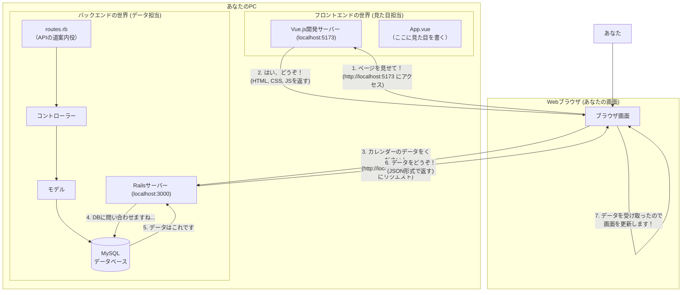

```mermaid
graph TD
    subgraph あなたのPC
        subgraph "フロントエンドの世界 (見た目担当)"
            A["Vue.js開発サーバー (localhost:5173)"]
            A_sub1["App.vue<br>（ここに見た目を書く）"]
        end

        subgraph "バックエンドの世界 (データ担当)"
            B["Railsサーバー (localhost:3000)"]
            B_sub1["routes.rb<br>（APIの道案内役）"] --> B_sub2["コントローラー"] --> B_sub3["モデル"] --> B_sub4[("MySQL<br>データベース")]
        end
    end

    subgraph "Webブラウザ (あなたの画面)"
        C["ブラウザ画面"]
    end

    YOU[あなた] --> C

    C -- "1. ページを見せて！<br>(http://localhost:5173 にアクセス)" --> A
    A -- "2. はい、どうぞ！<br>(HTML, CSS, JSを返す)" --> C

    C -- "3. カレンダーのデータをください！<br>(http://localhost:3000/api/... にリクエスト)" --> B
    B -- "4. DBに問い合わせますね..." --> B_sub4
    B_sub4 -- "5. データはこれです" --> B
    B -- "6. データをどうぞ！<br>(JSON形式で返す)" --> C

    C -- "7. データを受け取ったので<br>画面を更新します！" --> C
```
